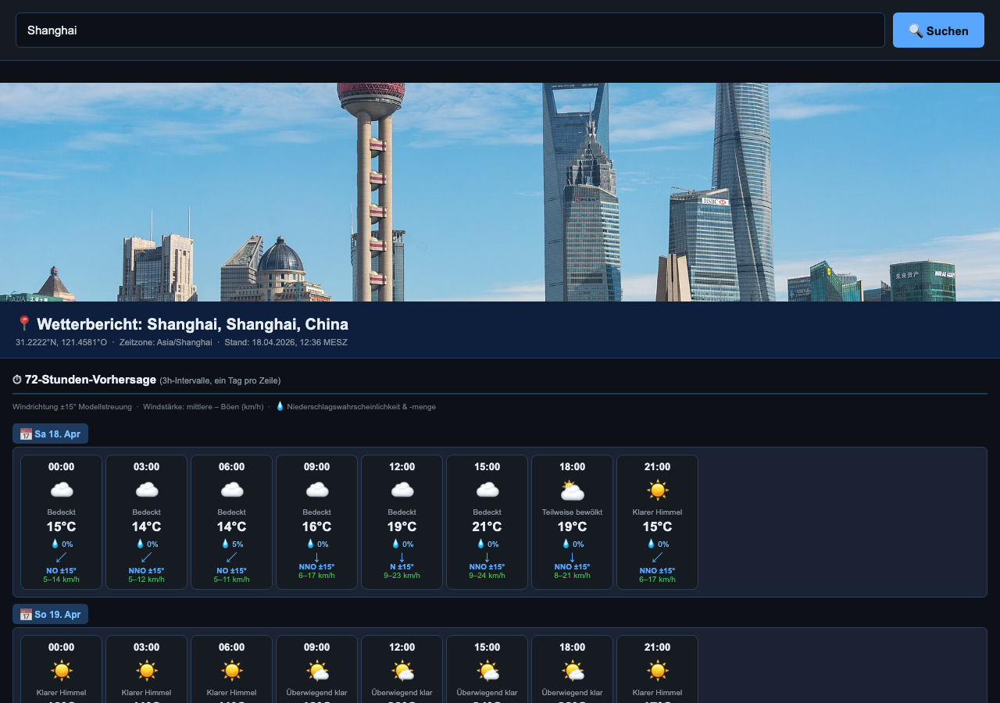

# WetterVorschau

A browser-based weather forecast app with a 72-hour and 14-day outlook for any location worldwide.



## Features

- **Auto-detects your location** via browser geolocation (falls back to Shanghai if denied)
- **72-hour forecast** in 3-hour intervals, grouped by day
- **14-day forecast** in daily cards, split by week
- Each card shows temperature, weather icon, wind direction (±15° uncertainty), and speed range (steady → gust km/h)
- **Location banner photo** pulled automatically from Wikipedia
- Fully client-side — no server, no build step, open `wetter.html` directly in a browser

## Usage

Open `wetter.html` in any modern browser, or visit the live version:

**[helmutqualtinger.github.io/WetterVorschau/wetter.html](https://helmutqualtinger.github.io/WetterVorschau/wetter.html)**

Type any location in the search bar (city, landmark, airport code) and press Enter or click Search.

## Weather Report Email Skill

`weather-report/scripts/weather_report.py` generates an HTML weather report and saves it as a draft in Apple Mail / Thunderbird via IMAP. Run with:

```bash
python3 weather-report/scripts/weather_report.py "München, Deutschland"
```

Requires `WETTER_MAIL_USER` and `WETTER_MAIL_PASS` environment variables for IMAP access.

## Data Sources

- Weather data: [Open-Meteo](https://open-meteo.com/) (free, no API key)
- Geocoding: Open-Meteo + OpenStreetMap Nominatim
- Banner photos: Wikipedia / Wikimedia Commons
